<a id="inicio"></a>

<div align="center">

# CRM Brooks Ambiental

### Desarrollo de un CRM web a medida para la gestión del ciclo comercial y la generación asistida de propuestas

**Trabajo Fin de Grado — Ingeniería Informática**  
**Brenda Lopes Ventura de Souza**  
**Director: David García Obeso**  
**Universidad Europea del Atlántico — 2026**

<br>

[🏠 Inicio](#inicio) &nbsp;·&nbsp;
[⚠️ Problema](#problema) &nbsp;·&nbsp;
[🧩 Modelo de Dominio](#modelo-de-dominio) &nbsp;·&nbsp;
[🔀 Estados](#estados-del-sistema) &nbsp;·&nbsp;
[👥 Actores & Casos de Uso](#actores-y-casos-de-uso) &nbsp;·&nbsp;
[🌍 Contexto](#diagrama-de-contexto) &nbsp;·&nbsp;
[🏗 Arquitectura](#arquitectura)

<br><br>

[🗄 Modelo de Datos](#modelo-de-datos) &nbsp;·&nbsp;
[🔄 Secuencias](#diagramas-de-secuencia) &nbsp;·&nbsp;
[💻 Implementación](#implementacion) &nbsp;·&nbsp;
[🧪 Pruebas](#pruebas) &nbsp;·&nbsp;
[📈 Resultados](#resultados) &nbsp;·&nbsp;
[⚠️ Limitaciones](#limitaciones) &nbsp;·&nbsp;
[🚀 Trabajo Futuro](#trabajo-futuro) &nbsp;·&nbsp;
[🎥 Demo](#demostracion-grabada)

</div>

---

## Inicio

Este proyecto aborda el análisis, diseño e implementación de un CRM web a medida para Brooks Ambiental, empresa de gestión de residuos ubicada en Palhoça, Santa Catarina, Brasil.

El sistema centraliza el ciclo comercial desde la entrada de un contacto potencial hasta la generación de una orden de servicio para el área de operaciones.

El trabajo se desarrolló mediante una adaptación de RUP:

**requisitos → análisis y diseño → construcción del MVP → pruebas y evaluación**

> El resultado es un MVP funcional desarrollado en un entorno controlado. No se trata todavía de una implantación completa en producción.

### Objetivo

Desarrollar una solución que permita:

- centralizar la información comercial;
- controlar el estado de las oportunidades;
- asistir la elaboración de cotizaciones;
- generar propuestas comerciales;
- mantener la trazabilidad de la negociación;
- estructurar el traspaso de información a operaciones.

### Alcance

El sistema cubre el proceso hasta la generación de la orden de servicio.

Quedan fuera del alcance:

- la ejecución operativa del servicio;
- la planificación de rutas;
- la facturación;
- la comunicación automática con SILC;
- la implantación productiva completa.

---

<a id="problema"></a>

## Problema

El proceso comercial de Brooks se apoyaba en canales y documentos no integrados, como WhatsApp, llamadas, correos y archivos independientes.

La elaboración de una propuesta tampoco es trivial: cada servicio puede combinar transporte, destino final, cantidad, unidad de medida, franquicia y precio por excedente.

> Proceso comercial actual de Brooks — AS-IS.

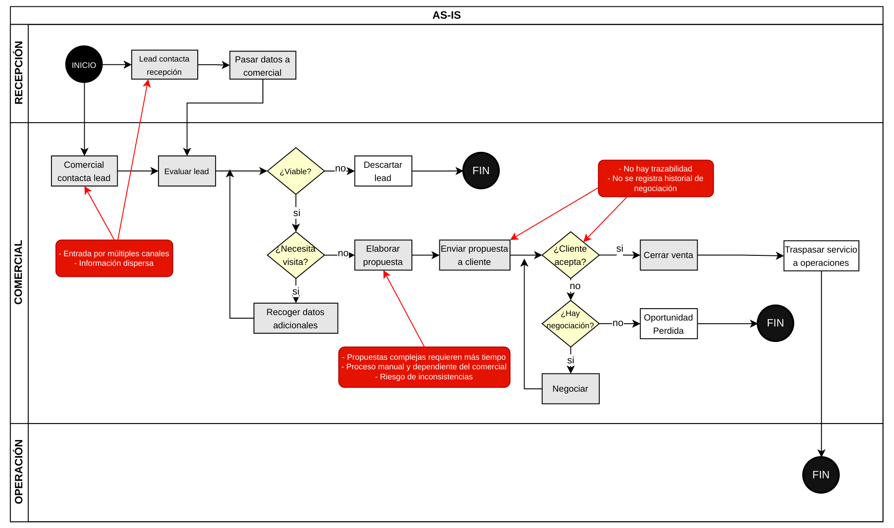

### Ideas clave

- Los contactos llegan por distintos canales.
- No existe un registro centralizado de las oportunidades.
- El estado real de cada negociación no siempre es visible.
- Las cotizaciones dependen en gran medida del criterio individual.
- Los cambios de precio no quedan registrados de forma estructurada.
- El traspaso a operaciones puede perder información necesaria para ejecutar el servicio.

<p align="right"><a href="#inicio">↑ Volver al menú</a></p>

---

<a id="modelo-de-dominio"></a>

## Modelo de Dominio

El modelo de dominio representa los principales conceptos del negocio y las relaciones entre ellos, sin introducir todavía decisiones de base de datos, frameworks o implementación.

Es la pieza central del proyecto: establece un vocabulario común y sirve de base para los casos de uso, los estados, el modelo de datos y la arquitectura.

> Mdelo de dominio completo

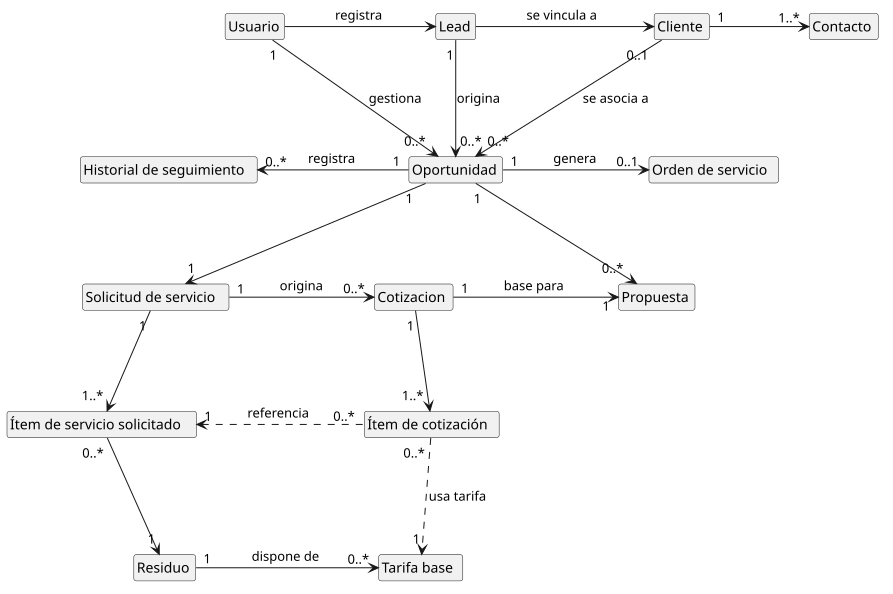

### Ideas clave

- El dominio se organiza en tres áreas: pipeline comercial, cotización y catálogo.
- `Oportunidad` es el eje del ciclo comercial.
- Un `Lead` puede originar una oportunidad y vincularse posteriormente con un `Cliente`.
- La `SolicitudServicio` reúne los datos técnicos necesarios para cotizar.
- La `Cotizacion` utiliza las tarifas como referencia, pero conserva los precios finalmente aplicados.
- La `Propuesta` es el documento comercial enviado al cliente y puede tener varias versiones.
- La `OrdenServicio` representa el traspaso estructurado al área de operaciones.

### Flujo conceptual principal

```text
Lead
  ↓
Oportunidad
  ↓
Solicitud de servicio
  ↓
Cotización
  ↓
Propuesta
  ↓
Negociación
  ↓
Orden de servicio
```

<p align="right"><a href="#inicio">↑ Volver al menú</a></p>

---

<a id="estados-del-sistema"></a>

## Estados del Sistema

La oportunidad y la propuesta tienen ciclos de vida distintos.

La oportunidad representa el avance del negocio dentro del pipeline. La propuesta representa la evolución del documento comercial durante la negociación.

### Estado de la oportunidad


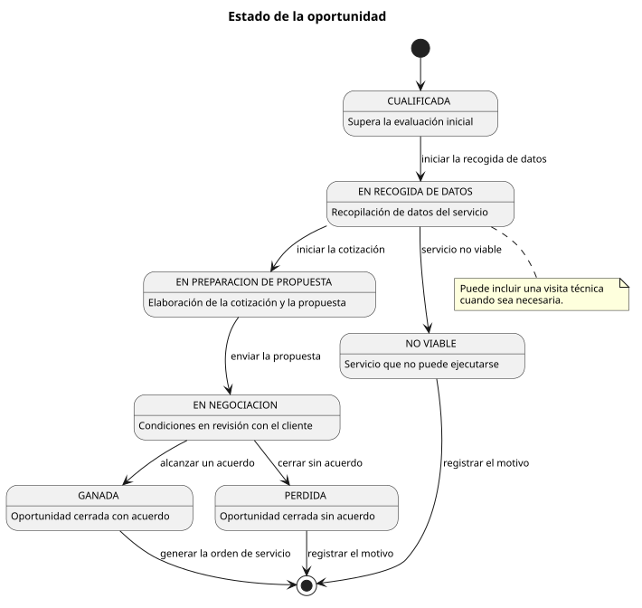

```text
Cualificada
  ↓
En recogida de datos
  ↓
En preparación de propuesta
  ↓
En negociación
  ↓
Ganada / Perdida

Desde las fases iniciales también puede cerrarse como No viable.
```

### Estado de la propuesta


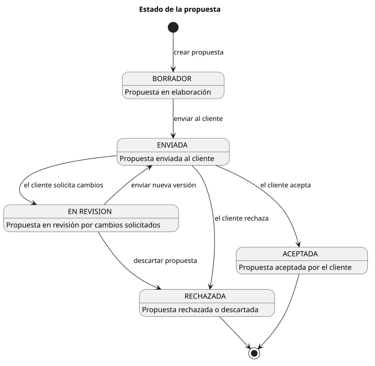

```text
Borrador
  ↓
Enviada
  ↓
En revisión
  ↓
Aceptada / Rechazada
```

### Ideas clave

- Las transiciones no son libres: responden al proceso comercial definido.
- La oportunidad puede finalizar como `Ganada`, `Perdida` o `No viable`.
- Una propuesta comienza como `Borrador`.
- Cuando el cliente solicita cambios, la propuesta pasa a `En revisión`.
- Una nueva versión no elimina las versiones anteriores.
- El frontend y el backend validan las transiciones permitidas.

<p align="right"><a href="#inicio">↑ Volver al menú</a></p>

---

<a id="actores-y-casos-de-uso"></a>

## Actores & Casos de Uso

El sistema contempla tres perfiles con responsabilidades y permisos diferentes.


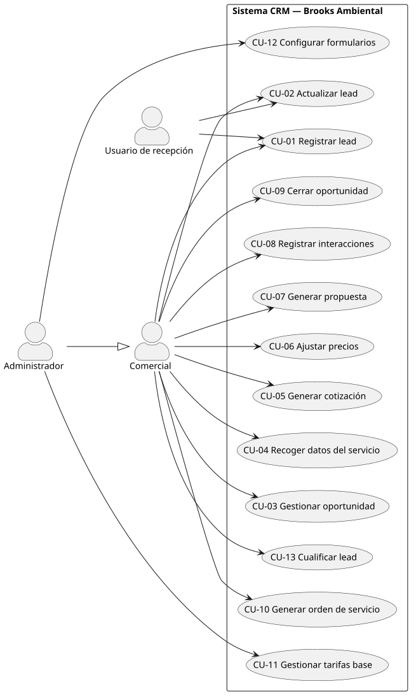

### Actores

| Actor | Responsabilidad |
|---|---|
| Recepción | Registrar y actualizar los datos iniciales de los leads |
| Comercial | Cualificar leads y gestionar oportunidades, cotizaciones, propuestas y cierres |
| Administrador | Realizar las funciones del comercial y gestionar la configuración del sistema |

La jerarquía de permisos es:

```text
Recepción ⊂ Comercial ⊂ Administrador
```

### Flujo funcional principal

- CU-01 — Registrar lead.
- CU-02 — Actualizar lead.
- CU-13 — Cualificar lead.
- CU-03 — Gestionar oportunidad.
- CU-04 — Recoger datos del servicio.
- CU-05 — Generar cotización.
- CU-06 — Ajustar precios.
- CU-07 — Generar propuesta.
- CU-08 — Registrar interacciones.
- CU-09 — Cerrar oportunidad.
- CU-10 — Generar orden de servicio.

### Funciones administrativas

- CU-11 — Gestionar tarifas base.
- CU-12 — Configurar formularios.

> El MVP implementa el flujo comercial principal. Las interfaces correspondientes a CU-11 y CU-12 quedaron fuera del alcance funcional de esta versión.

<p align="right"><a href="#inicio">↑ Volver al menú</a></p>

---

<a id="diagrama-de-contexto"></a>

## Diagrama de Contexto

El diagrama de contexto delimita el sistema y muestra los intercambios de información con los participantes externos.

A diferencia del modelo de dominio, no describe entidades internas: muestra quién interactúa con el CRM y hasta dónde llega su responsabilidad.


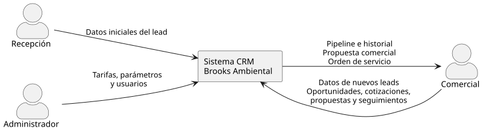

### Ideas clave

- Recepción, comercial y administrador interactúan directamente con el CRM.
- El cliente participa en el proceso de negocio, pero no accede directamente a la aplicación.
- El área de operaciones recibe la orden de servicio, pero tampoco utiliza directamente el CRM.
- El sistema genera propuestas y órdenes de servicio.
- El sistema no ejecuta el servicio ni gestiona la facturación.
- La frontera funcional termina con el handover a operaciones.

<p align="right"><a href="#inicio">↑ Volver al menú</a></p>

---

<a id="arquitectura"></a>

## Arquitectura

La solución sigue una arquitectura cliente-servidor organizada en capas, con separación entre presentación, lógica de negocio y persistencia.

El frontend y el backend se comunican mediante una API REST utilizando JSON.


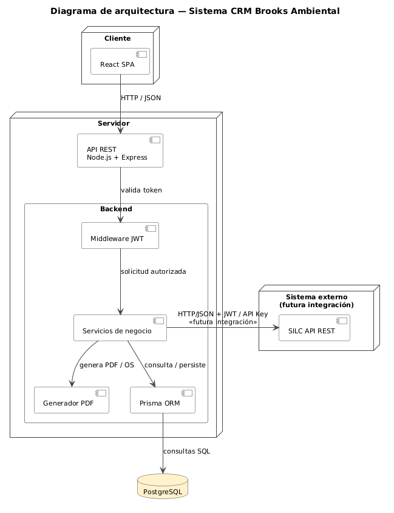

### Tecnologías principales

| Área | Tecnología |
|---|---|
| Frontend | React, TypeScript, Vite, Tailwind CSS |
| Comunicación | Axios, API REST, JSON |
| Backend | Node.js, Express, TypeScript |
| Persistencia | PostgreSQL, Prisma ORM |
| Autenticación | JWT |
| PDF | Puppeteer |
| Entorno | Docker |
| Control de versiones | Git y GitHub |

### Estructura

```text
React + TypeScript
        ↓
    API REST
        ↓
Node.js + Express
        ↓
    Prisma ORM
        ↓
    PostgreSQL
```

### Ideas clave

- El frontend no accede directamente a la base de datos.
- La API centraliza autenticación, validación y control de errores.
- El backend se separa internamente en rutas, controladores, servicios y acceso a datos.
- Prisma mantiene el esquema tipado y las relaciones.
- Puppeteer genera documentos PDF a partir de plantillas HTML.
- La futura integración con SILC está diseñada, pero no implementada.

<p align="right"><a href="#inicio">↑ Volver al menú</a></p>

---

<a id="modelo-de-datos"></a>

## Modelo de Datos

El modelo de datos traduce los conceptos del dominio a una estructura relacional implementable en PostgreSQL.

Para mantener la legibilidad, el DER se divide en dos diagramas: pipeline comercial y proceso de cotización.

### DER — Pipeline comercial


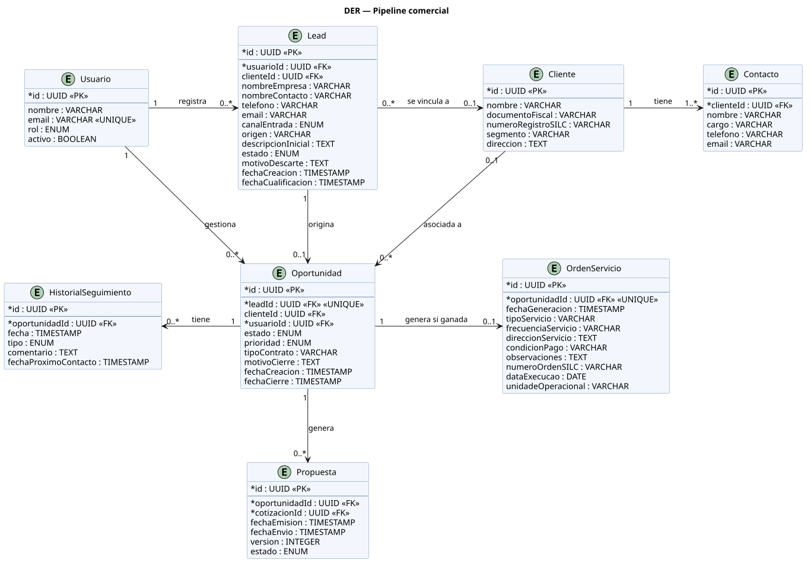

### DER — Proceso de cotización


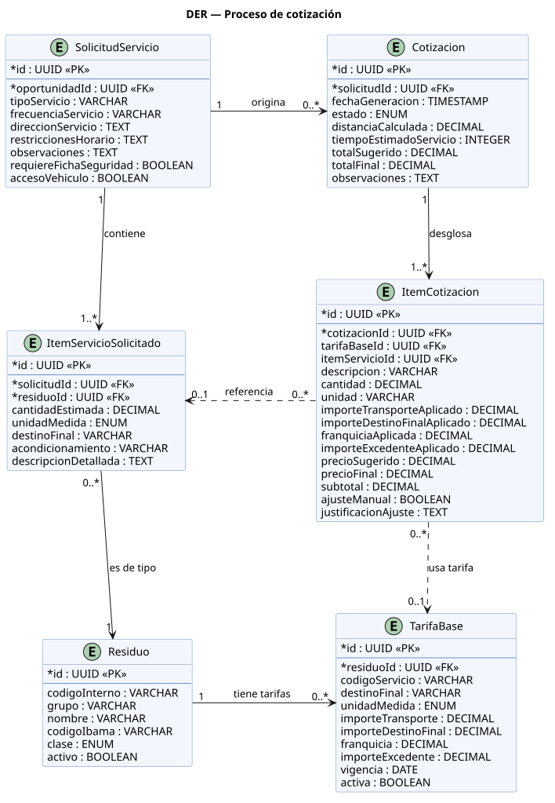

### Ideas clave

- Las entidades proceden del modelo de dominio.
- Las relaciones utilizan claves foráneas y restricciones de integridad.
- Las claves primarias utilizan UUID.
- Los importes y cantidades utilizan tipos decimales.
- Los estados se representan mediante enumeraciones.
- `ItemCotizacion` conserva los valores aplicados en cada cotización.
- Las modificaciones posteriores de una tarifa no alteran las cotizaciones ya generadas.
- `Cliente.numeroRegistroSilc` prepara el futuro mapeo con SILC.

<p align="right"><a href="#inicio">↑ Volver al menú</a></p>

---

<a id="diagramas-de-secuencia"></a>

## Diagramas de Secuencia

Los diagramas de secuencia muestran cómo colaboran la interfaz, los controladores, los servicios y la persistencia para ejecutar los casos de uso más importantes.

### CU-05 — Generar cotización


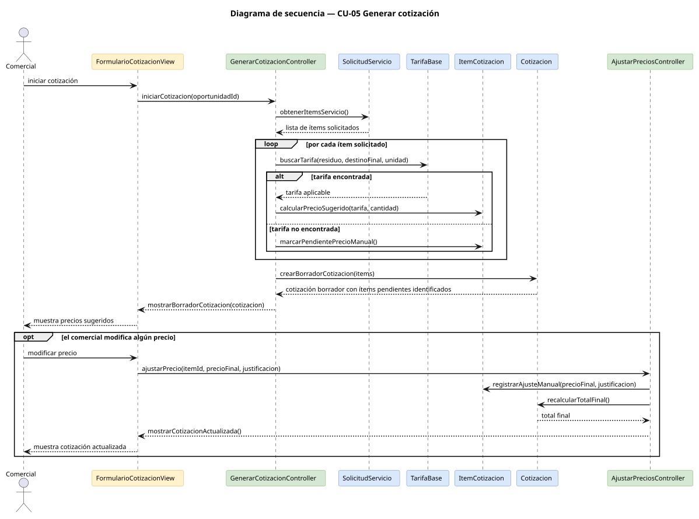

### CU-07 — Generar propuesta


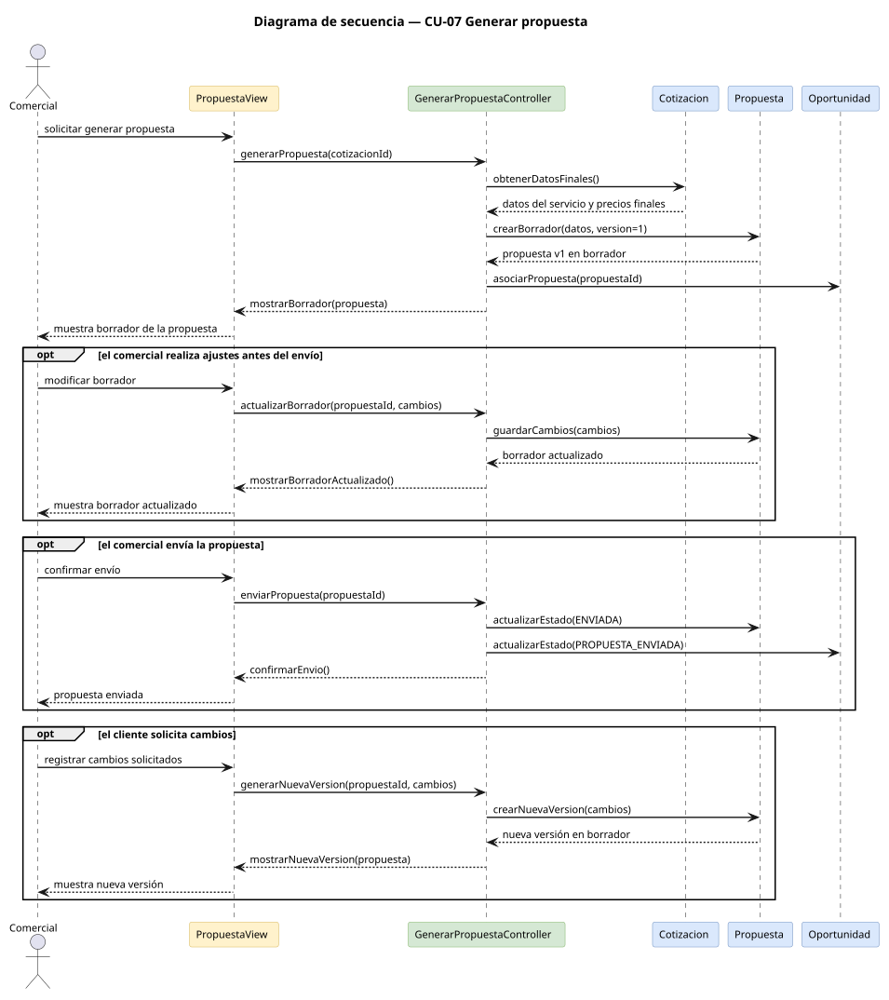

### CU-09 y CU-10 — Cerrar oportunidad y generar orden de servicio


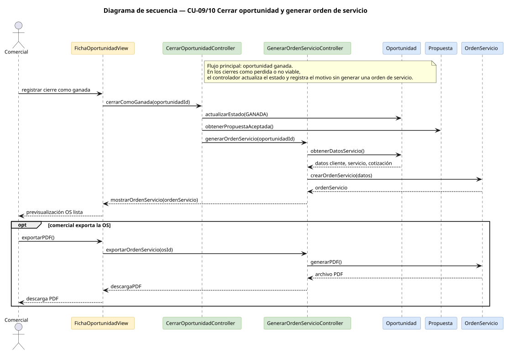

### Ideas clave

- La cotización localiza una tarifa mediante residuo, destino final y unidad de medida.
- Si no se encuentra una tarifa, el ítem queda pendiente de precio manual.
- Un cambio sobre el precio sugerido exige una justificación.
- La propuesta se crea inicialmente como borrador.
- Las nuevas versiones conservan el historial.
- El cierre como ganada genera la orden de servicio en la misma operación.

<p align="right"><a href="#inicio">↑ Volver al menú</a></p>

---

<a id="implementacion"></a>

## Implementación

El resultado es un MVP funcional que recorre el flujo comercial desde el registro inicial hasta la generación de la orden de servicio.


### Ideas clave

- El Kanban utiliza drag and drop con validación de transiciones.
- La ficha de oportunidad concentra los datos comerciales y técnicos.
- La cotización combina precios sugeridos y ajustes manuales justificados.
- La propuesta se genera mediante una plantilla adaptada al formato de Brooks.
- El sistema mantiene el historial de interacciones y versiones.
- El cierre como ganada genera la orden de servicio.

<p align="right"><a href="#inicio">↑ Volver al menú</a></p>

---

<a id="pruebas"></a>

## Pruebas

Las pruebas funcionales se realizaron manualmente combinando Postman para los endpoints del backend y el navegador para los flujos de interfaz.

| Resultado | Escenarios |
|---|---:|
| Validados sin necesidad de corrección | 9 |
| Defectos detectados, corregidos y verificados | 2 |
| No ejecutado por quedar fuera del MVP | 1 |

### Escenarios representativos

- detección de posibles leads duplicados;
- transición no permitida en el pipeline;
- creación y edición de una solicitud de servicio;
- cálculo del precio por franquicia y excedente;
- cotización de un residuo sin tarifa;
- ajuste de precio sin justificación;
- generación de una nueva versión de propuesta;
- registro de una interacción;
- cierre como ganada y generación de la orden de servicio;
- cierre como perdida sin indicar motivo;
- persistencia de la sesión al recargar la página.

### Defectos detectados

1. La edición de datos del servicio generaba solicitudes duplicadas.  
   Se corrigió diferenciando la creación mediante `POST` de la actualización mediante `PUT`.

2. Al recargar la aplicación, la sesión podía redirigir temporalmente al login.  
   Se corrigió añadiendo un estado de comprobación en `PrivateRoute`.

<p align="right"><a href="#inicio">↑ Volver al menú</a></p>

---

<a id="resultados"></a>

## Resultados

El MVP permite recorrer de forma estructurada el ciclo comercial de Brooks Ambiental.


### Resultados funcionales

- Registro y cualificación de leads.
- Gestión visual de oportunidades mediante Kanban.
- Recogida estructurada de datos del servicio.
- Cotización asistida utilizando tarifas de referencia.
- Registro de ajustes y justificaciones.
- Generación versionada de propuestas comerciales.
- Registro cronológico de interacciones.
- Cierre como ganada, perdida o no viable.
- Generación de la orden de servicio.
- Trazabilidad entre requisitos, diseño, código y pruebas.

> Los resultados demuestran el funcionamiento del MVP. No se han medido todavía reducciones reales de tiempo, mejoras de conversión o impacto económico, ya que el sistema no ha sido implantado en producción.

<p align="right"><a href="#inicio">↑ Volver al menú</a></p>

---

<a id="limitaciones"></a>

## Limitaciones

El alcance del proyecto corresponde a un MVP y presenta limitaciones conocidas.

### Limitaciones actuales

- El sistema no está desplegado en producción.
- La integración automática con SILC no está implementada.
- El catálogo contiene datos de prueba y no el catálogo completo de Brooks.
- El precio de transporte se introduce actualmente de forma manual.
- CU-11, gestión de tarifas desde la interfaz, quedó fuera del MVP.
- CU-12, configuración dinámica de formularios, quedó fuera del MVP.
- La interfaz solo expone el contacto principal de cada cliente.
- No se ha realizado una validación prolongada con todos los usuarios finales.
- No se dispone todavía de métricas empresariales longitudinales.

<p align="right"><a href="#inicio">↑ Volver al menú</a></p>

---

<a id="trabajo-futuro"></a>

## Trabajo Futuro

La arquitectura permite ampliar el sistema sin modificar su estructura principal.

### Integración con SILC


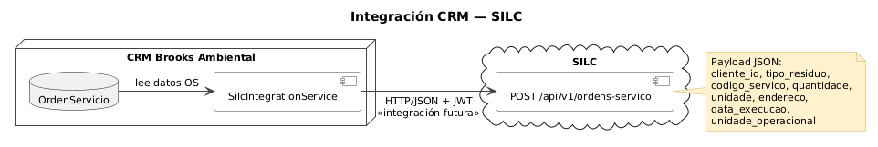

```text
CRM
  ↓
Orden de servicio
  ↓
Payload JSON
  ↓
API REST / HTTPS
  ↓
SILC
```

El mecanismo de autenticación entre ambos sistemas deberá acordarse con el equipo responsable de SILC.

### Siguientes incrementos

- Implementar el panel de administración de tarifas.
- Importar el catálogo real de residuos y precios.
- Calcular automáticamente la distancia mediante Google Maps o Mapbox.
- Gestionar múltiples contactos por cliente desde la interfaz.
- Crear un dashboard de métricas comerciales.
- Implementar la comunicación automática con SILC.
- Desplegar el frontend, el backend y la base de datos en producción.
- Realizar pruebas de usabilidad con usuarios reales.

<p align="right"><a href="#inicio">↑ Volver al menú</a></p>

---

## Conclusión

El proyecto transforma un proceso comercial basado en información dispersa en una solución estructurada, trazable y adaptada a las particularidades de Brooks Ambiental.

La principal aportación no es únicamente la aplicación desarrollada, sino la coherencia entre:

```text
Problema
  ↓
Requisitos
  ↓
Modelo de dominio
  ↓
Diseño
  ↓
Implementación
  ↓
Pruebas
```

El resultado es una base funcional y documentada sobre la que Brooks puede continuar la evolución del CRM hasta su implantación e integración con SILC.

---

<a id="demostracion-grabada"></a>

## Demostración Grabada

El siguiente vídeo muestra el flujo funcional principal del sistema:

```text
Inicio de sesión
  ↓
Registro y cualificación de lead
  ↓
Gestión de oportunidad
  ↓
Recogida de datos del servicio
  ↓
Cotización asistida
  ↓
Ajuste de precio con justificación
  ↓
Generación de propuesta
  ↓
Cierre como ganada
  ↓
Generación de orden de servicio
```

### ▶ [Ver vídeo de demostración del sistema](https://drive.google.com/drive/folders/1gxJhAxKWs9OtZcYkrlbTZFA6p2GyBLo2?dmr=1&ec=wgc-drive-%5Bmodule%5D-goto)

> La demostración ha sido grabada con datos ficticios y no contiene información confidencial de Brooks Ambiental.

<p align="right"><a href="#inicio">↑ Volver al menú</a></p>