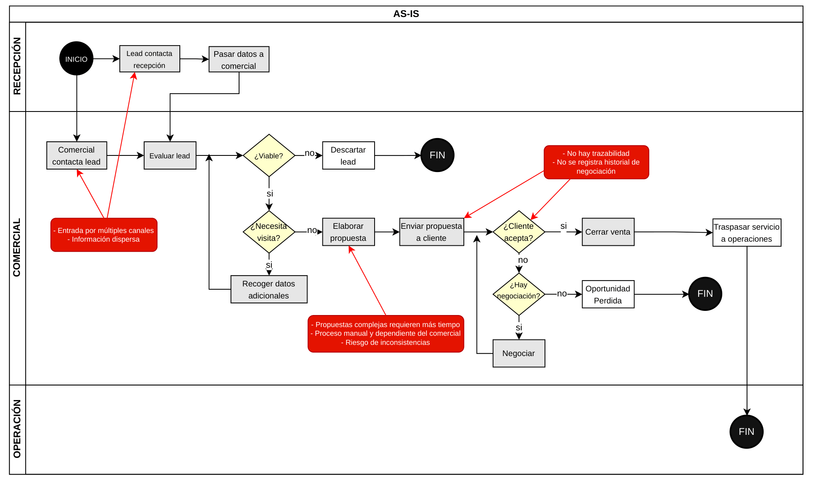

## 3.1 Descripción del proceso actual (AS-IS) y proceso objetivo (TO-BE)

### 3.1.1 Proceso actual (AS-IS)

El proceso comercial actual de Brooks Ambiental comienza con la captación de un cliente potencial y finaliza con el traspaso del servicio al área de operación.

La captación del lead puede producirse a través de distintos canales, como llamadas, WhatsApp o contacto directo del equipo comercial. Esta información no se registra en un sistema centralizado, lo que provoca dispersión de datos y falta de visibilidad del estado real de las oportunidades.

Una vez recibido el contacto, el comercial evalúa la viabilidad del servicio. En caso necesario, solicita información adicional al cliente, como tipo de residuo, cantidad estimada, ubicación o condiciones de acceso. Esta recogida de información se realiza de forma no estructurada y depende del criterio individual de cada comercial.

La elaboración de la propuesta es manual. El precio se define combinando referencias informales de tarifas con la experiencia del comercial, teniendo en cuenta factores como la distancia o el tiempo de recogida. Este proceso no deja registro del cálculo ni de las decisiones tomadas.

Durante la negociación, las interacciones con el cliente se realizan a través de canales externos y no quedan registradas. Finalmente, la oportunidad se cierra como ganada o perdida. En caso de éxito, la información se transfiere al área de operación de forma no estructurada.

#### Limitaciones del proceso actual

| Problema | Impacto |
|----------|--------|
| Falta de registro centralizado | Pérdida de información y baja visibilidad del pipeline |
| Información no estructurada | Propuestas inconsistentes |
| Cotización manual | Dificultad para controlar precios y márgenes |
| Sin historial de negociación | Pérdida de contexto comercial |
| Traspaso a operación informal | Riesgo de errores en la ejecución |

#### Entradas y salidas del proceso

| Entradas | Salidas |
|---------|--------|
| Solicitudes de clientes | Propuesta comercial |
| Información del residuo | Resultado (ganado/perdido) |
| Datos del cliente | Información para operación |

---

### 3.1.2 Proceso objetivo (TO-BE)

El proceso objetivo introduce una gestión estructurada del ciclo comercial mediante un sistema CRM.

A diferencia del proceso actual, cada oportunidad se registra desde el primer contacto y avanza a través de estados definidos, garantizando trazabilidad completa en todas las fases.

Todo contacto se registra como un lead, independientemente del canal de entrada. A partir de ahí, el comercial decide si el lead se convierte en una oportunidad viable.

Una vez cualificada, el comercial recoge la información del servicio mediante un formulario estructurado dentro del sistema. Estos datos incluyen tipo de servicio, frecuencia, tipo de residuo, cantidad estimada, ubicación y condiciones de acceso.

A partir de esta información, el sistema genera una cotización asistida. El cálculo combina tarifas predefinidas (por ejemplo, asociadas a residuos o servicios logísticos) con variables contextuales como la distancia o condiciones específicas del servicio. El sistema propone un precio, pero el comercial puede ajustarlo, quedando registrados tanto el valor sugerido como el valor final.

La cotización sirve como base para la generación de la propuesta comercial. Durante la negociación, la propuesta puede modificarse y todas las interacciones quedan registradas en el sistema.

El proceso finaliza con el cierre de la oportunidad como ganada, perdida o no viable. En caso de éxito, la información se transfiere al área operativa de forma estructurada.