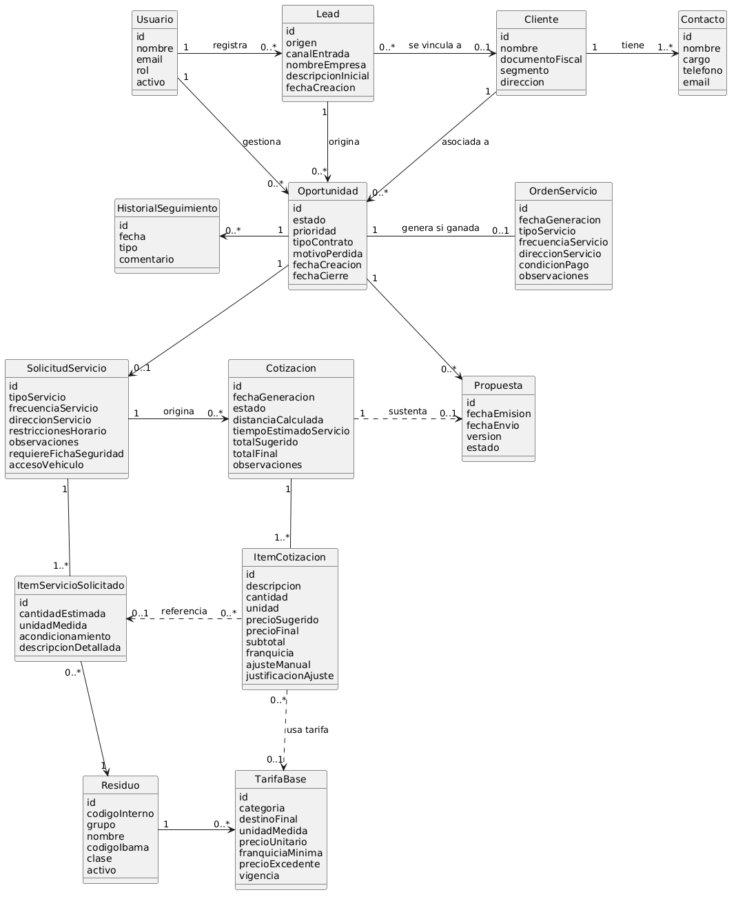
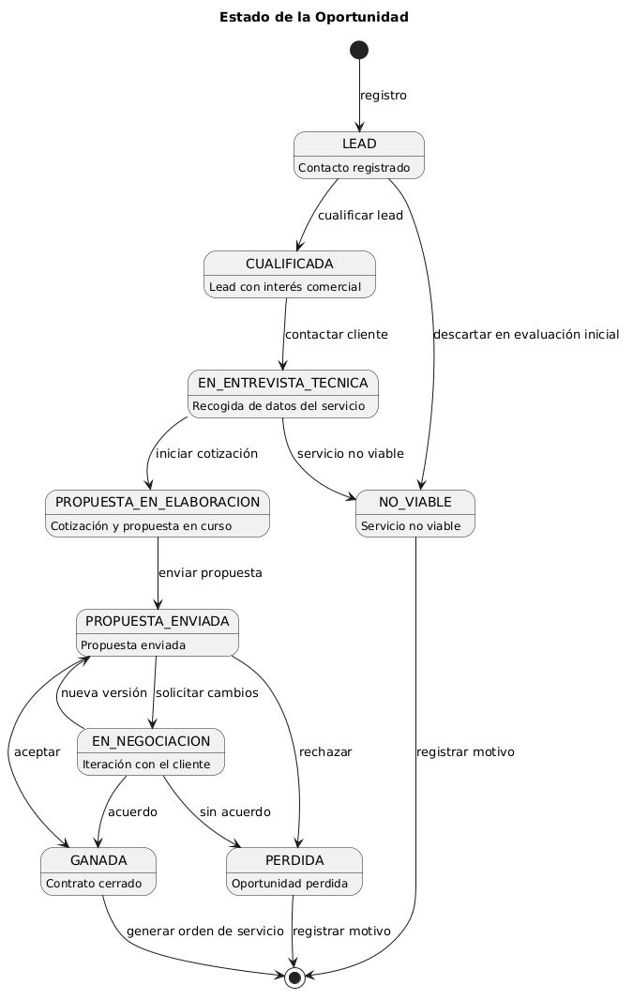
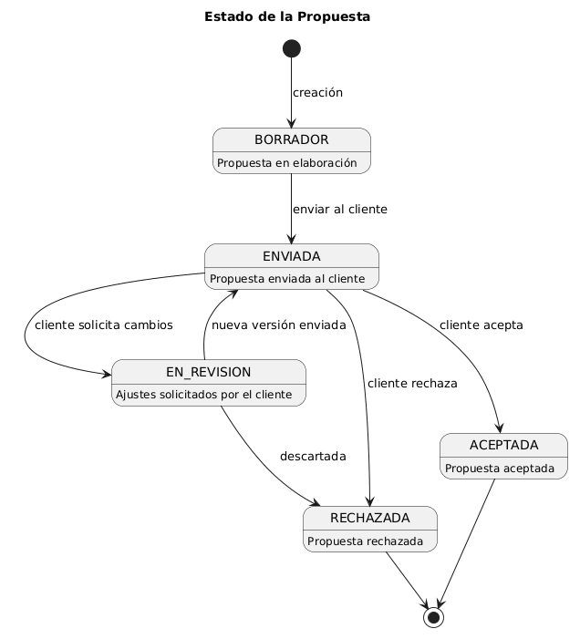

## 3.1 Descripción del proceso actual (AS-IS) y proceso objetivo (TO-BE)

### 3.1.1 Proceso actual (AS-IS)
El proceso comercial actual de Brooks Ambiental comienza con la captación de un cliente potencial y finaliza con el traspaso del servicio al área de operación.

La captación del lead puede producirse a través de distintos canales, como llamadas, WhatsApp o contacto directo del equipo comercial. Esta información no se registra en un sistema centralizado, lo que provoca dispersión de datos y falta de visibilidad del estado real de las oportunidades.

Una vez recibido el contacto, el comercial evalúa la viabilidad del servicio. En caso necesario, solicita información adicional al cliente, como tipo de residuo, cantidad estimada, ubicación o condiciones de acceso. Esta recogida de información se realiza de forma no estructurada y depende del criterio individual de cada comercial.

La elaboración de la propuesta es manual. El precio se define combinando referencias informales de tarifas con la experiencia del comercial, teniendo en cuenta factores como la distancia o el tiempo de recogida. Este proceso no deja registro del cálculo ni de las decisiones tomadas.

Durante la negociación, las interacciones con el cliente se realizan a través de canales externos y no quedan registradas. Finalmente, la oportunidad se cierra como ganada o perdida. En caso de éxito, la información se transfiere al área de operación de forma no estructurada.

#### Limitaciones del proceso actual

| Problema | Impacto |
|----------|--------|
| Falta de registro centralizado | Pérdida de información y baja visibilidad del pipeline |
| Información no estructurada | Propuestas inconsistentes |
| Cotización manual | Dificultad para controlar precios y márgenes |
| Sin historial de negociación | Pérdida de contexto comercial |
| Traspaso a operación informal | Riesgo de errores en la ejecución |

#### Entradas y salidas del proceso

| Entradas | Salidas |
|---------|--------|
| Solicitudes de clientes | Propuesta comercial |
| Información del residuo | Resultado (ganado/perdido) |
| Datos del cliente | Información para operación |

---

### 3.1.2 Proceso objetivo (TO-BE)

El proceso objetivo introduce una gestión estructurada del ciclo comercial mediante un sistema CRM.

A diferencia del proceso actual, cada oportunidad se registra desde el primer contacto y avanza a través de estados definidos, garantizando trazabilidad completa en todas las fases.

Todo contacto se registra como un lead, independientemente del canal de entrada. A partir de ahí, el comercial decide si el lead se convierte en una oportunidad viable.

Una vez cualificada, el comercial recoge la información del servicio mediante un formulario estructurado dentro del sistema. Estos datos incluyen tipo de servicio, frecuencia, tipo de residuo, cantidad estimada, ubicación y condiciones de acceso.

A partir de esta información, el sistema genera una cotización asistida. El cálculo combina tarifas predefinidas (por ejemplo, asociadas a residuos o servicios logísticos) con variables contextuales como la distancia o condiciones específicas del servicio. El sistema propone un precio, pero el comercial puede ajustarlo, quedando registrados tanto el valor sugerido como el valor final.

La cotización sirve como base para la generación de la propuesta comercial. Durante la negociación, la propuesta puede modificarse y todas las interacciones quedan registradas en el sistema.

El proceso finaliza con el cierre de la oportunidad como ganada, perdida o no viable. En caso de éxito, la información se transfiere al área operativa de forma estructurada.

# 3.2 Modelo de dominio

El modelo del dominio representa los principales conceptos del proceso comercial y las relaciones entre ellos, proporcionando una abstracción del funcionamiento del negocio independiente de la implementación técnica.

Este modelo permite identificar las entidades clave implicadas en la gestión comercial y en la generación asistida de propuestas, sirviendo como base para el diseño posterior del sistema.

---

## 3.2.1 Diagrama de clases del dominio
El diagrama representa la estructura conceptual del proceso comercial, organizando las entidades en tres bloques: el pipeline comercial, el proceso de cotización y el catálogo de tarifas.

  
*Figura X — Diagrama de clases del dominio*

Una decisión importante del modelo es separar la solicitud de servicio  de la cotización. La solicitud recoge los datos técnicos del cliente durante la cualificación y esos mismos datos sirven de base para generar la cotización, sin que ambas cosas queden mezcladas. De forma similar, la cotización y la propuesta son entidades distintas, lo que permite ajustar o versionar la propuesta sin tocar el cálculo original.

Respecto a los precios, el modelo permite que un mismo residuo tenga tarifas diferentes según el destino final, algo que refleja cómo funciona realmente la precificación en este tipo de negocio.

## 3.2.2 Diagramas de estados

Además del diagrama de clases, se modelan los estados de las dos entidades cuyo ciclo de vida tiene más impacto en el proceso comercial: la oportunidad y la propuesta.

### Estado de la oportunidad

Una oportunidad puede descartarse como no viable en dos momentos distintos: antes de contactar con el cliente, si en la evaluación inicial ya se determina que no tiene sentido avanzar, o después de la entrevista técnica, si el comercial concluye que el servicio no puede ejecutarse. Si avanza, pasa por la elaboración y envío de la propuesta, pudiendo entrar en negociación antes de cerrarse como ganada o perdida.

*Figura X — Diagrama de estados de la oportunidad*

### Estado de la propuesta

Una propuesta empieza como borrador y puede enviarse al cliente, quien puede aceptarla, rechazarla o pedir cambios. Si pide cambios, la propuesta entra en revisión y el comercial puede generar una nueva versión o descartarla si no hay continuidad.

*Figura X — Diagrama de estados de la propuesta*

## 3.2.3 Glosario de entidades

Las entidades del modelo se organizan en tres grupos según su función dentro del proceso comercial.

### Pipeline comercial

| Entidad | Definición |
|---|---|
| **Usuario** | Persona con acceso al sistema. Su rol determina qué puede hacer: registrar leads, gestionar oportunidades o configurar el sistema. |
| **Lead** | Registro inicial de un contacto con potencial comercial. Puede venir de una llamada, WhatsApp, web o prospección activa. No todo lead acaba siendo una oportunidad. |
| **Cliente** | Empresa o persona con la que Brooks tiene o ha tenido relación comercial. Un lead puede vincularse a un cliente existente o dar origen a uno nuevo. |
| **Contacto** | Persona física asociada a un cliente. Un cliente puede tener varios contactos. |
| **Oportunidad** | Lead que ha pasado la evaluación inicial y entra en el pipeline comercial. Recoge el tipo de contrato, la prioridad y, si se pierde, el motivo. |
| **HistorialSeguimiento** | Registro de las interacciones asociadas a una oportunidad: llamadas, correos, reuniones o notas. Evita que la información dependa de una sola persona. |
| **OrdenServicio** | Registro generado cuando se cierra una oportunidad como ganada. Consolida los datos técnicos y comerciales para el traspaso a operación. |

### Proceso de cotización

| Entidad | Definición |
|---|---|
| **SolicitudServicio** | Recoge los datos técnicos del servicio durante la cualificación: tipo de servicio, frecuencia, dirección, condiciones de acceso y requisitos especiales. Sus datos sirven como base para la cotización. |
| **ItemServicioSolicitado** | Cada residuo declarado dentro de una solicitud, con su cantidad estimada, unidad de medida y acondicionamiento. |
| **Cotizacion** | Cálculo económico del servicio. Registra el total sugerido por el sistema y el total final aplicado por el comercial, además de variables como la distancia calculada. |
| **ItemCotizacion** | Línea de precio dentro de una cotización. Puede corresponder a un residuo, un concepto logístico o un ajuste manual. Si el comercial modifica el precio sugerido, queda registrada la justificación. |
| **Propuesta** | Documento generado a partir de la cotización y enviado al cliente. Puede tener varias versiones a lo largo de la negociación. |

### Catálogo

| Entidad | Definición |
|---|---|
| **Residuo** | Tipo de residuo gestionado por Brooks, identificado por su código interno y código IBAMA. |
| **TarifaBase** | Precio de referencia configurado por el administrador para un residuo, destino final y unidad de medida concretos. Un mismo residuo puede tener tarifas distintas según el destino, reflejando la variabilidad del coste real del servicio. |

## 3.3 Requisitos de usuario

Los requisitos de usuario recogen las necesidades y expectativas de los distintos usuarios respecto al sistema, identificadas a partir del análisis del proceso comercial y de las limitaciones del proceso actual.

| ID | Título | Descripción | Prioridad |
|---|---|---|---|---|
| RU-01 | Registro de lead | El usuario debe poder registrar nuevos leads con sus datos básicos y canal de origen. | Alta |
| RU-02 | Actualización de lead | El usuario debe poder visualizar y actualizar los datos de un lead existente. | Alta |
| RU-03 | Gestión del pipeline | El usuario debe poder gestionar oportunidades a lo largo de su ciclo de vida mediante un pipeline visual. | Alta |
| RU-04 | Recogida de datos del servicio | El usuario debe poder registrar los datos técnicos necesarios para definir el servicio antes de cotizar. | Alta |
| RU-05 | Cotización asistida | El usuario debe poder generar una cotización con precios sugeridos por el sistema a partir de los datos recogidos. | Alta |
| RU-06 | Ajuste de precios | El usuario debe poder ajustar manualmente los precios sugeridos, dejando constancia del cambio y su justificación. | Alta |
| RU-07 | Generación de propuesta | El usuario debe poder generar una propuesta comercial a partir de una cotización. | Alta |
| RU-08 | Historial de negociación | El usuario debe poder registrar las interacciones con el cliente a lo largo de la negociación. | Alta |
| RU-09 | Cierre de oportunidad | El usuario debe poder cerrar una oportunidad como ganada, perdida o no viable, registrando el motivo cuando corresponda. | Alta |
| RU-10 | Orden de servicio | El usuario debe poder preparar la Orden de Servicio al cerrar una oportunidad como ganada. | Alta |
| RU-11 | Gestión de tarifas | El usuario administrador debe poder gestionar las tarifas base asociadas a residuos, destinos finales y unidades de medida. | Alta |
| RU-12 | Configuración del formulario | El usuario administrador debe poder configurar campos del formulario sin intervención técnica. | Media |

## 3.4 Requisitos funcionales

Los requisitos funcionales describen el comportamiento específico que debe ofrecer el sistema para satisfacer los requisitos de usuario definidos.

| ID | Título | Descripción | RU | Prioridad |
|---|---|---|---|---|
| RF-01 | Registro de lead | El sistema debe permitir registrar leads con datos de contacto, empresa, canal de entrada y observaciones iniciales. | RU-01 | Alta |
| RF-02 | Detección de duplicados | El sistema debe alertar al usuario si el contacto ya existe para evitar duplicados. | RU-01 | Media |
| RF-03 | Pipeline de oportunidades | El sistema debe permitir avanzar una oportunidad por los estados definidos: Lead, Cualificada, Propuesta en elaboración, Propuesta enviada, En negociación, Ganada, Perdida y No viable. | RU-03 | Alta |
| RF-04 | Formulario de recogida de datos | El sistema debe permitir registrar los datos técnicos del servicio: tipo de servicio, frecuencia, dirección, tipo de residuo, cantidad, acondicionamiento, condiciones de acceso y requisitos especiales. | RU-04 | Alta |
| RF-05 | Distancia del servicio | El sistema debe calcular o registrar la distancia asociada al servicio a partir de la dirección de recogida, pudiendo apoyarse en un servicio externo de mapas. | RU-05 | Alta |
| RF-06 | Precio sugerido | El sistema debe calcular precios sugeridos por ítem utilizando tarifas base y variables asociadas al servicio, como residuo, destino final, unidad de medida y conceptos logísticos. | RU-05 | Alta |
| RF-07 | Pre-relleno de datos | El sistema debe reutilizar los datos recogidos durante la fase de recogida de información para completar la cotización cuando sea posible. | RU-05 | Alta |
| RF-08 | Ajuste manual de precio | El sistema debe permitir al comercial ajustar el precio sugerido de cualquier ítem, registrando el precio sugerido, el precio final y la justificación del ajuste. | RU-06 | Alta |
| RF-09 | Generación de propuesta | El sistema debe generar una propuesta comercial a partir de los datos de la cotización. | RU-07 | Alta |
| RF-10 | Versionado de propuesta | El sistema debe permitir generar nuevas versiones de una propuesta durante la negociación, manteniendo el historial de versiones anteriores. | RU-07 | Media |
| RF-11 | Registro de interacciones | El sistema debe permitir registrar interacciones con el cliente indicando tipo, fecha y comentario. | RU-08 | Alta |
| RF-12 | Cierre de oportunidad | El sistema debe permitir cerrar una oportunidad como ganada, perdida o no viable, registrando el motivo en los dos últimos casos. | RU-09 | Alta |
| RF-13 | Generación de orden de servicio | El sistema debe permitir generar una Orden de Servicio al cerrar una oportunidad como ganada, consolidando los datos técnicos y comerciales. | RU-10 | Alta |
| RF-14 | Exportación de orden de servicio | El sistema debe permitir exportar la Orden de Servicio en un formato consultable por el área operativa. | RU-10 | Alta |
| RF-15 | Autenticación y roles | El sistema debe requerir autenticación para acceder y aplicar los permisos correspondientes al rol del usuario. | RU-01 a RU-12 | Alta |
| RF-16 | Gestión de tarifas | El sistema debe permitir al Administrador añadir, editar y desactivar tarifas base por residuo, destino final y unidad de medida. | RU-11 | Alta |
| RF-17 | Configuración del formulario | El sistema debe permitir al Administrador configurar campos del formulario sin intervención técnica. | RU-12 | Media |
| RF-18 | Snapshot de tarifas | El sistema debe conservar los valores de tarifa vigentes en el momento de creación de cada cotización, independientemente de cambios posteriores en la configuración. | RU-11 | Alta |

## 3.5 Requisitos no funcionales

Los requisitos no funcionales definen las propiedades y restricciones del sistema, estableciendo cómo debe comportarse en términos de rendimiento, seguridad, usabilidad y otros criterios de calidad.

| ID | Categoría | Título | Descripción | Prioridad |
|---|---|---|---|---|
| RNF-01 | Usabilidad | Interfaz intuitiva | La interfaz debe ser operable sin formación técnica avanzada. Las acciones principales deben realizarse en el menor número de pasos posible. | Alta |
| RNF-02 | Usabilidad | Idioma | La interfaz debe estar en portugués de Brasil, idioma operativo del equipo de Brooks Ambiental. | Alta |
| RNF-03 | Rendimiento | Tiempo de respuesta | El sistema debe responder a las acciones principales del usuario en tiempos adecuados para su uso operativo. | Media |
| RNF-04 | Seguridad | Autenticación y control de acceso | El sistema debe requerir autenticación para acceder. Cada usuario solo puede acceder a las funciones correspondientes a su rol. | Alta |
| RNF-05 | Trazabilidad | Registro de cambios | Las modificaciones relevantes deben quedar registradas con usuario, fecha y acción realizada. | Alta |
| RNF-06 | Integridad | Snapshot de cotización | El sistema debe conservar el estado de la cotización en el momento de su creación. Los cambios en tarifas no afectan a cotizaciones ya generadas. | Alta |
| RNF-07 | Disponibilidad | Persistencia de datos | El sistema debe garantizar la persistencia de los datos almacenados sin pérdida de información. | Alta |
| RNF-08 | Mantenibilidad | Configuración sin código | La gestión de tarifas y campos del formulario debe poder realizarse sin modificar el código del sistema. | Alta |
| RNF-09 | Extensibilidad | Integración futura con SILC | La arquitectura debe permitir una futura integración con SILC sin rediseño estructural del sistema. | Baja |

## 3.6 Casos de uso y Criterios de aceptación 
## 3.6.1 Actores
A partir de los requisitos definidos, se identifican los actores que interactúan con el sistema, diferenciados por su nivel de acceso y responsabilidades dentro del proceso comercial.

| Actor | Descripción | Responsabilidades principales |
|---|---|---|
| **Usuario de captación** | Usuario encargado de registrar contactos con potencial comercial en el sistema. | Registrar nuevos leads, visualizar y actualizar sus datos básicos. No puede avanzar el estado del lead ni acceder a cotizaciones o configuración. |
| **Comercial** | Usuario responsable de gestionar el ciclo comercial completo. | Cualificar leads, recoger los datos del servicio, elaborar cotizaciones, generar propuestas, registrar negociaciones y cerrar oportunidades. |
| **Administrador** | Usuario con acceso a las funciones de configuración del sistema. | Puede realizar las funciones del Comercial y, además, gestionar tarifas base, configurar formularios y administrar usuarios. |

## 3.6.2 Casos de uso

Los casos de uso describen las principales interacciones entre los actores y el sistema, cubriendo el flujo completo del proceso comercial desde el registro de un lead hasta el cierre de la oportunidad.

### Casos de uso del proceso comercial

| ID | Caso de uso | Actor |
|---|---|---|
| CU-01 | Registrar lead | Usuario de captación / Comercial |
| CU-02 | Actualizar lead | Usuario de captación / Comercial |
| CU-03 | Gestionar oportunidad | Comercial |
| CU-04 | Recoger datos del servicio | Comercial |
| CU-05 | Generar cotización | Comercial |
| CU-06 | Ajustar precios de cotización | Comercial |
| CU-07 | Generar propuesta | Comercial |
| CU-08 | Registrar interacciones | Comercial |
| CU-09 | Cerrar oportunidad | Comercial |
| CU-10 | Generar orden de servicio | Comercial |

### Casos de uso de configuración

| ID | Caso de uso | Actor |
|---|---|---|
| CU-11 | Gestionar tarifas base | Administrador |
| CU-12 | Configurar formulario | Administrador |
